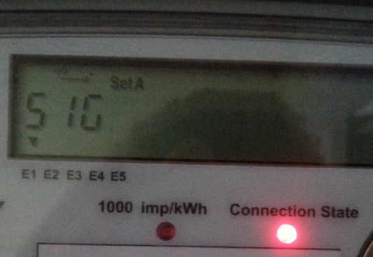

# ArduinoSmartMeterReader

Arduino/Photon library to read realtime usage from smart electricity meters

Some smart meters have an LED that flashes to indicate how much electricity is currently being used.  
The meter will be labelled like `1000 imp/kWh` (impressions per kWh). An impression is a flash of the LED. For the meter in the image below, 1000 flashes of the LED indicates that 1 kWh of power has been used. Not all meters are 1000 imp/kWh.



```
current power use = seconds per hour / (seconds between flashes * impressions per kWh)
```

For a meter with 1000 imp/kWh and a time of 3 seconds between flashes, the current power use is 1.2 kW.
```
3600 / (3 * 1000) = 1.2 kW
```

SmartMeterReader defaults to 1000 imp/kWh, but this can be changed by calling `setImpressionsPerkWh`.

The library is designed to be driven by an interrupt on the photoresistor pin to make sure every pulse is received.


## Example Usage

```c
#include "SmartMeterReader.h"

const int pulseLedPin = 4;
const int photoresistorPin = 3;

SmartMeterReader smartMeterReader(photoresistorPin);
float reading;

void recordFlashISR() {
  smartMeterReader.recordFlash();
}

void setup() {
  Serial.begin(9600);
  pinMode(pulseLedPin, OUTPUT);
  attachInterrupt(digitalPinToInterrupt(photoresistorPin), recordFlashISR, RISING);
}

void loop() {
  if (smartMeterReader.hasReading()) {
    reading = smartMeterReader.reading();

    Serial.print("Latest reading is ");
    Serial.print(reading);
    Serial.println(" kW");

    digitalWrite(pulseLedPin, HIGH);
    delay(10);
    digitalWrite(pulseLedPin, LOW);
  }

  delay(50);
}

```

[smart-meter-reader.ino](examples/smart-meter-reader.ino) provides a more comprehensive example of use.  
[photon-live-update.ino](examples/photon-live-update.ino) shows how to get live updates of the readings over the internet.


## Documentation

The [docs](docs/) directory has a circuit diagram for the project, along with a bill of materials.  

In order to test your project without a smart meter, a linear [potentiometer](https://www.adafruit.com/products/562) can be used to make an LED flash faster or slower. See [smart meter simulator](docs/SmartMeterSimulator.md) for a circuit diagram and a bill of materials. The examples directory has a [smart-meter-simulator.ino](examples/smart-meter-simulator.ino) sketch to run the simulator.

## Ideas for extension

* Use a [RGB LCD](https://www.adafruit.com/products/398) to display the current usage and change the background colour to indicate power usage at a glance.